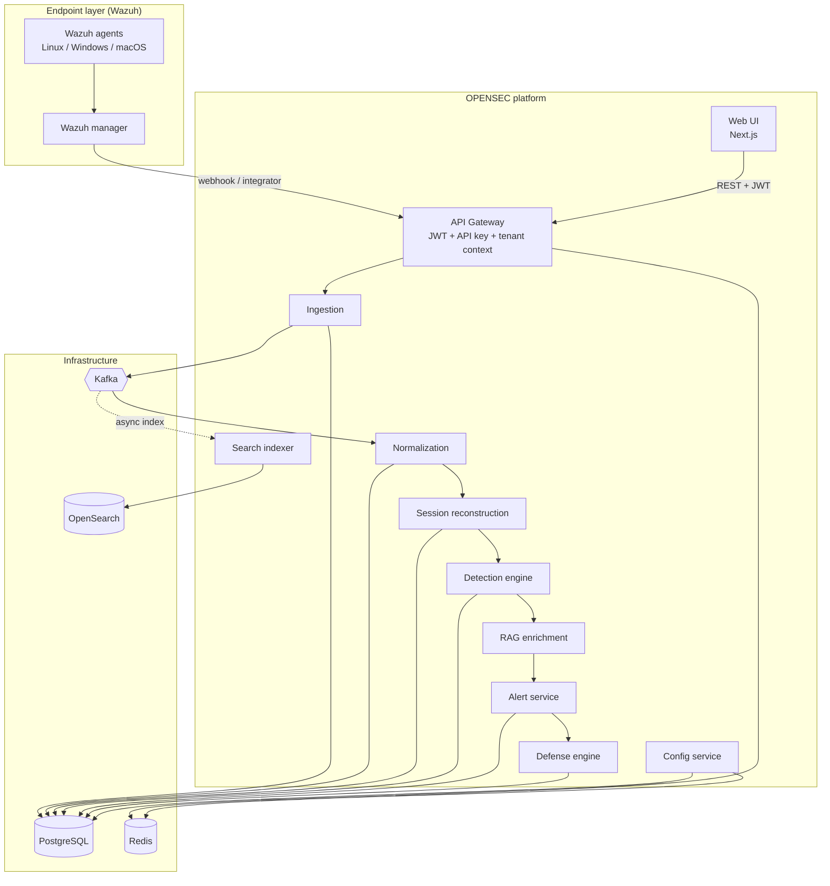
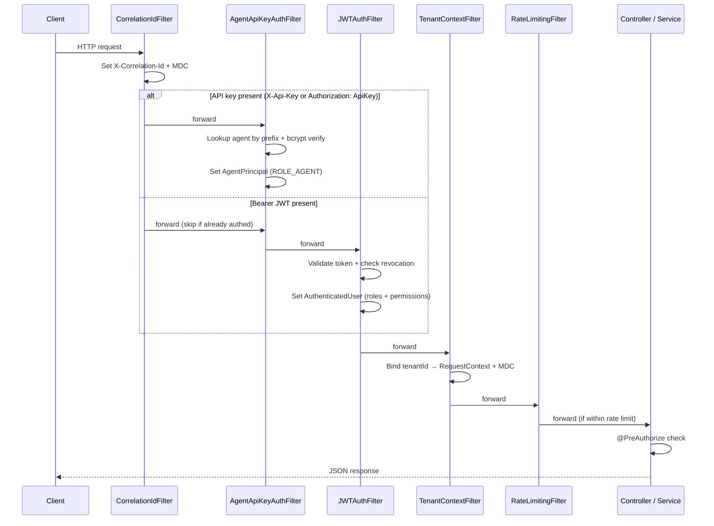
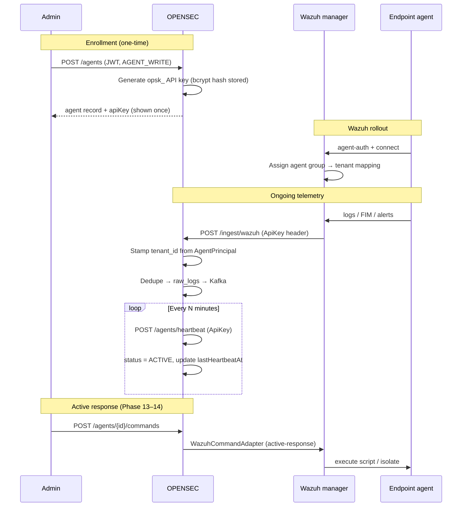
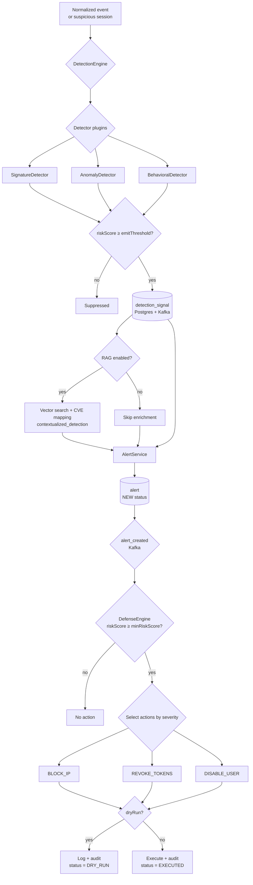
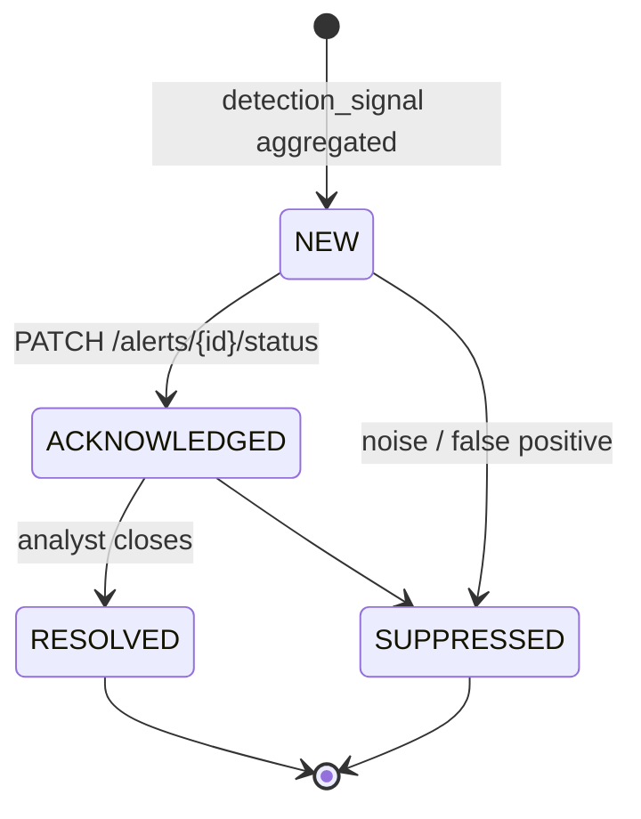
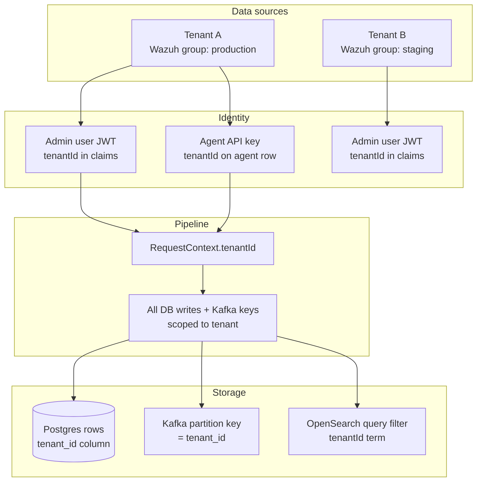
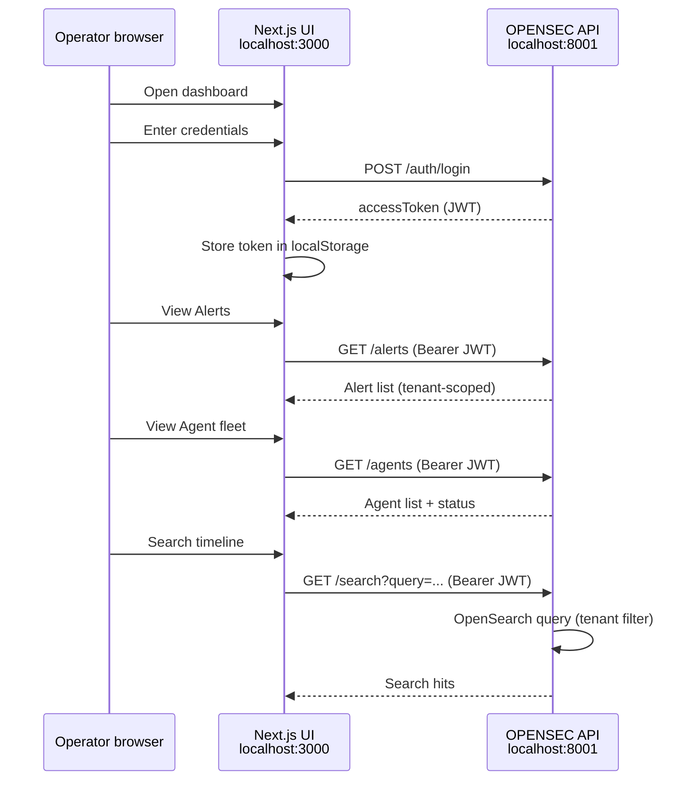
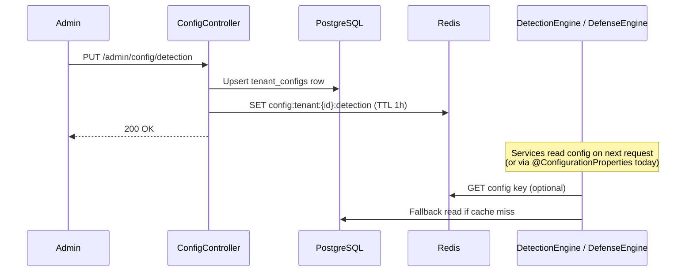
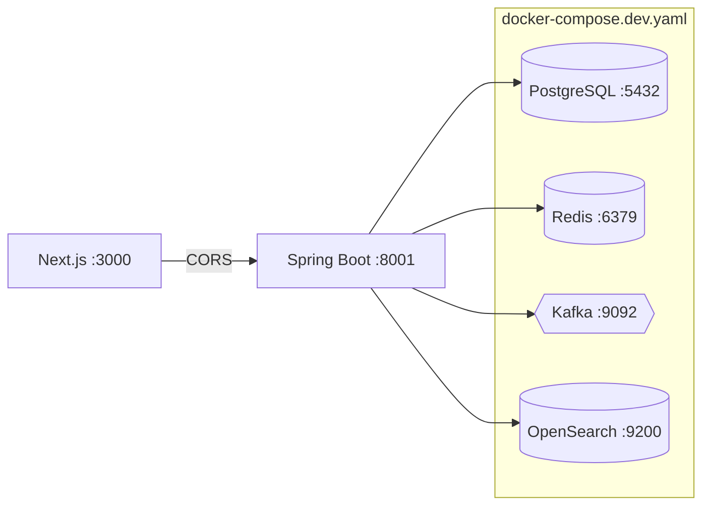

# OPENSEC — Architecture & Flow Diagrams

Visual reference for how data, auth, and control flow through the platform.
All API paths are prefixed with `/api/v1`.

> Related: [`BUILD_PLAN.md`](./BUILD_PLAN.md) · [`PRD.md`](./PRD.md) · [`AGENT_ENROLLMENT.md`](./AGENT_ENROLLMENT.md) · [`PLUGINS.md`](./PLUGINS.md)

---

## 1. System overview

OPENSEC is a Spring Boot monolith with an event-driven pipeline. Wazuh agents collect endpoint telemetry; OPENSEC adds intelligence, alerting, and automated response on top.



---

## 2. End-to-end telemetry pipeline

Every ingested log travels through Kafka topics. Each stage is a separate consumer group, so stages scale independently.

```mermaid
flowchart LR
    subgraph Ingest["Phase 5–6"]
        A1[POST /ingest/logs<br/>POST /ingest/wazuh] --> A2[IngestionService]
        A2 --> A3[(raw_logs<br/>Postgres)]
        A2 -->|raw_log.ingested| T1[[raw_logs]]
    end

    subgraph Normalize["Phase 7"]
        T1 --> B1[RawLogKafkaListener]
        B1 --> B2[NormalizationService<br/>WazuhLogParser / GenericLogParser]
        B2 --> B3[(normalized_events)]
        B2 -->|normalized event| T2[[normalized_events]]
    end

    subgraph Sessions["Phase 8"]
        T2 --> C1[NormalizedEventKafkaListener]
        C1 --> C2[SessionReconstructionService<br/>sliding window + rules]
        C2 --> C3[(sessions)]
        C2 -->|session_updated<br/>suspicious_session_detected| T3[[session_events]]
    end

    subgraph Detection["Phase 9"]
        T2 --> D1[DetectionKafkaListener]
        T3 --> D1
        D1 --> D2[DetectionEngine<br/>Signature / Anomaly / Behavioral]
        D2 --> D3[(detection_signals)]
        D2 -->|detection_signal| T4[[detection_signals]]
    end

    subgraph Enrich["Phase 11"]
        T4 --> E1[RagKafkaListener]
        E1 --> E2[RagEnrichmentService<br/>vector search + LLM]
        E2 -->|contextualized_detection| T5[[contextualized_detections]]
    end

    subgraph Alerts["Phase 12"]
        T4 --> F1[AlertKafkaListener]
        T5 --> F1
        F1 --> F2[AlertService<br/>aggregate + risk score]
        F2 --> F3[(alerts)]
        F2 -->|alert_created| T6[[alert_events]]
    end

    subgraph Defense["Phase 14"]
        T6 --> G1[DefenseKafkaListener]
        G1 --> G2[DefenseEngine<br/>dry-run + executors]
        G2 --> G3[(defense_actions)]
        G2 -->|defense_action_executed| T7[[defense_events]]
    end

    subgraph Search["Phase 10"]
        T2 -.-> H1[SearchIndexKafkaListener]
        T3 -.-> H1
        T4 -.-> H1
        H1 --> H2[(OpenSearch)]
    end
```



### Kafka topics summary

| Topic | Producer | Key consumers |
|-------|----------|---------------|
| `raw_logs` | IngestionService | Normalization |
| `normalized_events` | NormalizationService | Sessions, Detection, Search |
| `session_events` | SessionReconstructionService | Detection, Search |
| `detection_signals` | DetectionEngine | RAG, Alerts, Search |
| `contextualized_detections` | RagEnrichmentService | Alerts |
| `alert_events` | AlertService | Defense |
| `defense_events` | DefenseEngine | (audit / integrations) |

All records are keyed by `tenant_id` for per-tenant ordering.

---

## 3. HTTP request & auth flow

Every authenticated request passes through a filter chain before reaching controllers.



### Auth methods

| Caller | Header | Principal | Typical endpoints |
|--------|--------|-----------|-----------------|
| Human (UI / admin) | `Authorization: Bearer <jwt>` | `AuthenticatedUser` | `/alerts`, `/agents`, `/admin/*` |
| Enrolled agent | `X-Api-Key: opsk_…` or `Authorization: ApiKey opsk_…` | `AgentPrincipal` | `/ingest/*`, `/agents/heartbeat` |

---

## 4. Agent enrollment & telemetry flow

Per [ADR-001](./BUILD_PLAN.md#adr-001-wazuh-as-the-endpoint--collection-layer), Wazuh collects endpoint data; OPENSEC manages fleet identity and API credentials.



---

## 5. Detection → alert → defense flow

How a suspicious event becomes an operator-visible alert and optionally triggers automated response.



### Alert lifecycle



---

## 6. Multi-tenancy model

Tenant isolation is enforced at every layer — never from client-supplied payload fields.



---

## 7. Plugin architecture

Detection rules and defense actions are pluggable `@Component` beans discovered at startup.

```mermaid
flowchart LR
    subgraph Author["Plugin author"]
        P1[@Component<br/>MyDetector]
        P2[@Component<br/>MyDefenseAction]
    end

    subgraph Core["OPENSEC core"]
        REG[PluginRegistry]
        DE[DetectionEngine]
        DF[DefenseEngine]
    end

    P1 -->|implements Detector| DE
    P2 -->|implements DefenseExecutor| DF
    P1 & P2 --> REG
    REG --> API[GET /admin/plugins]
```

See [`PLUGINS.md`](./PLUGINS.md) for authoring instructions.

---

## 8. Operator UI flow

The Next.js console (`ui/`) talks to the same REST API as integrations.



---

## 9. Config hot-reload flow

Tenant-specific thresholds and policies are stored in Postgres and cached in Redis.



---

## 10. Local development topology



### Quick start

```bash
docker compose -f docker-compose.dev.yaml up -d
./gradlew bootRun
cd ui && npm install && npm run dev
```
